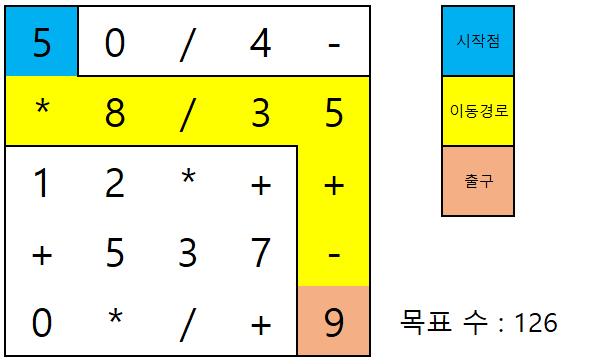

당신은 숫자와 사칙연산 기호로 이루어진 미로를 탈출하려 합니다.

미로는 1x1 크기의 정사각형 격자로 구성되어 있으며, 각 격자에는 0~9까지의 숫자 또는 사칙연산 기호(+,-,*,/) 중 하나가 적혀있습니다.

당신이 놓여있는 시작지점엔 항상 숫자가 쓰여있으며, 그 숫자가 당신이 가지고 시작하는 최초의 수입니다. 당신은 상하좌우로 인접한 칸으로만 이동할 수 있으며, 한 번 갔던 칸으로는 다시 갈 수 없습니다. 당신이 이동할 때마다 해당 칸에 적혀있는 숫자나 사칙연산에 따라 당신의 수가 바뀝니다. 

 
당신이 미로를 한 칸 이동할 때 벌어지는 일은 다음과 같습니다.

* 직전에 있던 곳이 숫자인 경우
    * 이동한 곳이 숫자인 경우, 당신의 수가 ((현재 수*10) + 이동한 곳의 숫자) 가 됩니다. 예를 들어 현재 수가 12고 이동한 곳의 숫자가 6이면 126이 됩니다.
    * 이동한 곳이 사칙연산인 경우, 해당 사칙연산이 저장됩니다.
* 직전에 있던 곳이 사칙연산인 경우
    * 이동한 곳이 숫자인 경우, 현재 수와 이동한 곳의 숫자를 저장된 사칙연산으로 계산하여 현재 수가 변경됩니다. 단, 나누기(/) 연산의 경우 0으로 나눌 수 없으며, 0이 아닌 수로 나눈 결과가 정수가 아닐 경우 소수점 아래 버림한 결과를 저장합니다. 
    * 이동한 곳이 사칙연산인 경우, 저장된 사칙연산이 이동한 곳의 사칙연산으로 변경됩니다.

 
출구에 도착하더라도 항상 탈출할 수 있는 건 아닙니다. 출구에 도착했을 때 당신의 수가 주어진 목표 수와 같아야지만 탈출할 수 있습니다. 당신의 목적은 탈출할 수 있는 경로가 총 몇 개인지를 알아내는 것입니다.

 
예를 들어 미로와 이동 경로가 다음과 같다면, 아래 순서대로 진행됩니다.

 

 

1. 시작 지점의 숫자는 5이므로 현재 수는 5입니다.
2. *를 만나 *가 저장됩니다.
3. 현재 수(5)와 이동한 곳의 숫자(8)를 저장된 연산(*)하여 현재 수는 40이 됩니다.
4. /를 만나 /가 저장됩니다.
5. 현재 수(40)와 이동한 곳의 숫자(3)를 저장된 연산(/)하여 현재 수는 13이 됩니다.
6. 연달아 숫자를 만났으므로, 현재 수는 (현재 수(13)*10 + 이동한 곳의 숫자(5)) = 135가 됩니다.
7. +를 만나 +가 저장됩니다.
8. 연달아 사칙연산을 만나 저장된 +가 사라지고 -가 저장됩니다.
9. 현재 수(135)와 이동한 곳의 숫자(9)를 저장된 연산(-)하여 현재 수는 126이 됩니다. 출구에 도착했으므로 현재 수(126)와 목표 수(126)를 비교합니다. 두 값이 동일하므로 이 경로는 탈출할 수 있는 경로입니다.

 

미로를 나타내는 문자열 배열 `maze`와 시작 지점의 좌표를 나타내는 정수 배열 `sloc`, 출구의 좌표를 나타내는 정수 배열 `eloc`, 목표 수를 나타내는 정수 `target`이 매개변수로 주어집니다.

탈출 경로의 개수를 return 하도록 solution 함수를 작성해주세요.

 

## 제한 사항

* 미로
  * 2 ≤ `maze`의 문자열 하나의 길이(=미로의 가로 크기) ≤ 5
  * 2 ≤ `maze`의 문자열의 개수(=미로의 세로 크기) ≤ 5
  * `maze`의 한 칸에는 숫자 0~9 또는 사칙연산(+,-,*,/) 중 하나가 있습니다.

* 좌표
  * 좌표는 (행, 열)로 표현되며, 다음과 같습니다.
  
    
  * 미로의 시작점 `sloc`과 출구 `eloc`는 서로 다릅니다.
  * 미로의 `sloc`과 `eloc` 위치에는 반드시 숫자가 있습니다.

* 연산
  * 0으로 나눌 수 없습니다. 즉, 저장된 연산자가 나누기(/)이면 숫자 0인 칸으로는 이동할 수 없습니다.
  * 나누기(/) 연산의 결과는 소수점 버림하여 정수부분만 취합니다.
    * 3.67 => 3
    * -4.83 => -4

 

## 입출력 예

|                   maze                    | sloc  | eloc  | target | return |
| :---------------------------------------: | :---: | :---: | :----: | :----: |
| ["50/4-","*8/35","12*++","+537-","0*/+9"] | [0,0] | [4,4] |  126   |   1    |
| ["50/4-","*8/35","12*++","+537-","0*/+9"] | [0,0] | [4,4] |  120   |   2    |
| ["50/4-","*8/35","12*++","+537-","0*/+9"] | [3,2] | [2,0] |  3521  |   2    |
|                ["1+","+2"]                | [0,0] | [1,1] |   2    |   0    |

 

## 입출력 예 설명

 

### 입출력 예 #1

문제 예시 외에 다른 탈출 경로는 없습니다.

 

### 입출력 예 #2

탈출 경로 2가지는 다음과 같습니다.

이 외에 다른 탈출 경로는 없습니다.

 

### 입출력 예 #2

탈출 경로 2가지는 다음과 같습니다.

이 외에 다른 탈출 경로는 없습니다.

 

### 입출력 예 #3

어느 방향으로 가도 숫자는 3이 되기 때문에 탈출 경로가 없습니다.